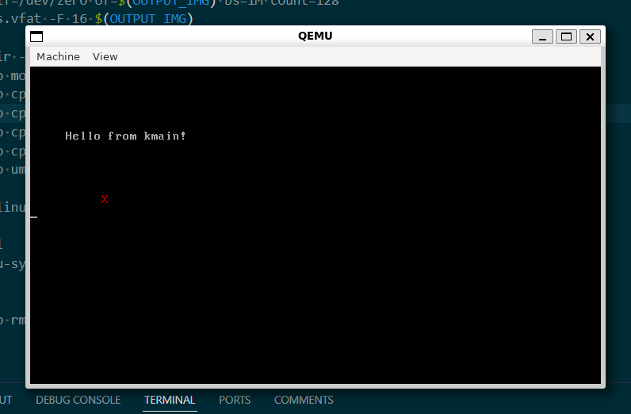

# OS93
My second attempt OS from scratch.

Written with the help of ChatGPT and GitHub Copilot.

# Building and Running
In Pardus 23 (Debian-based), those packages should be installed:

    build-essential gcc-i686-linux-gnu nasm qemu-system-x86 mtools syslinux

After installing these packages and cloning this repository, you can build and run with that command:

    make run

## Copyright and License
Copyright (c) 2025 Erdem Ersoy (adminekspi). Licensed with MIT license.

See COPYING for full license text.
